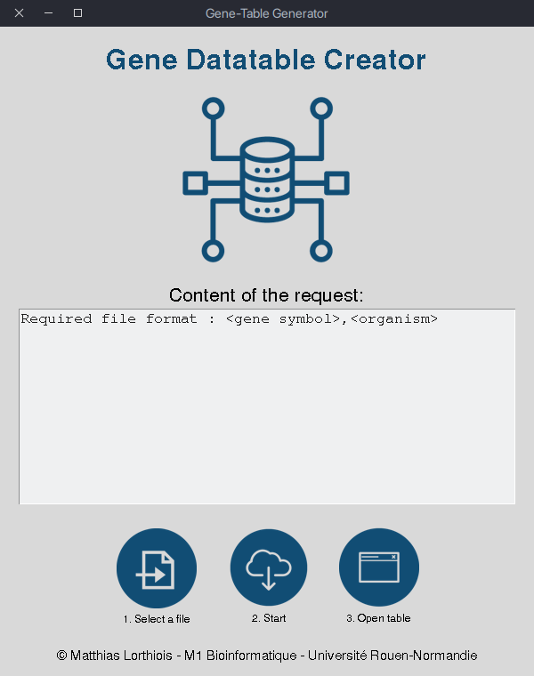
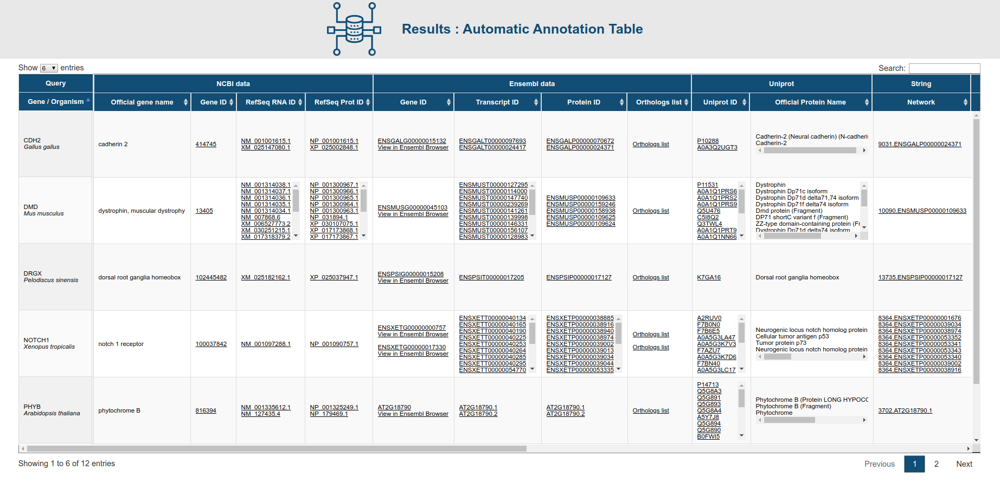

# Generate a HTML table from a txt file

## Required
- Python 3.6 or later
- BioPython
- TXT file that contain, per line, `<genesymbol>,<organism>`. Example:
```
RAD51,homo_sapiens
DMD,mus_musculus
```

## Usage

In the app installation folder, use the command line :

```bash
$ python3 app.py
```

It will launch the interface :



In order :

1. Click on the left button to import your gene file in a .txt format, or write your request in the same format directly in the text input form.
2. Start the queries by clicking on the center icons.
3. When the text widget become green, click on the right button to open the result table in your default browser.

## Output format



To store the results file, go to the main folder and copy the Results.html file elsewhere.
